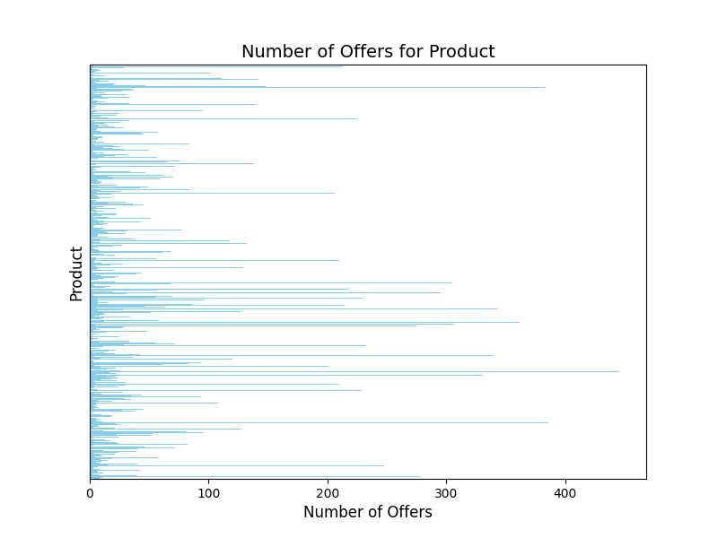
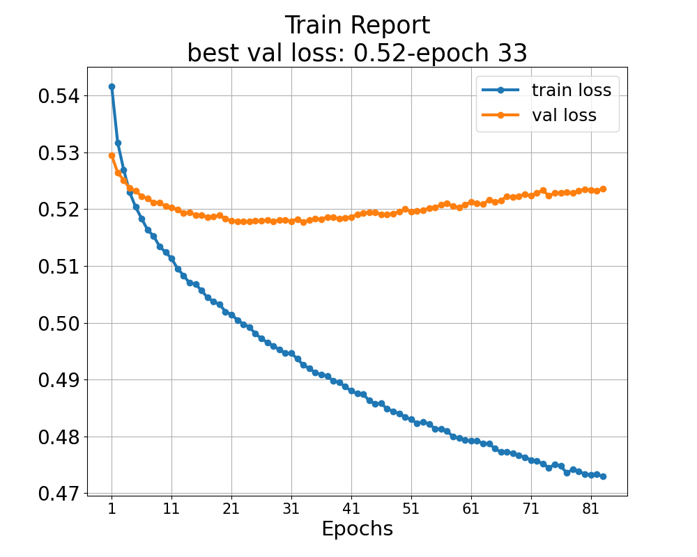
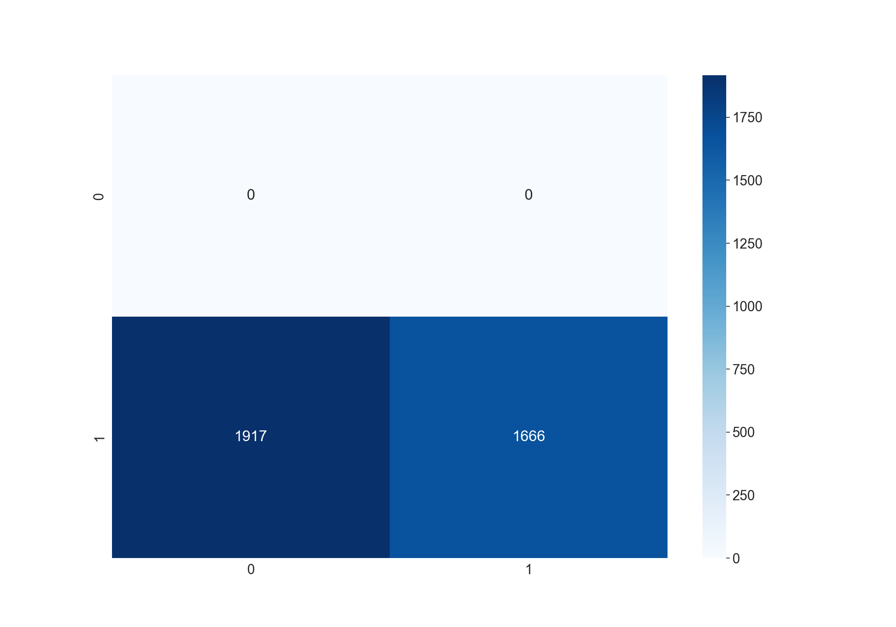

# 🛍️ OfferXpert

A simple product matcher for a given offer.

The primary objective of this project is to construct a machine learning-based
model capable of associating a product with a provided offer. The project is
divided into two key phases:

1. **Retrieval**
2. **Ranker**

In the retrieval phase, product and vector attributes are transformed into
vectors using the GloVE model and subsequently input into a Siamese neural
network. This network features a shared architecture for both product and offer
vectors, and it is trained to minimize the dot product between these two vector
types. Upon completion of the training process, the resulting product vectors
are indexed to facilitate efficient similarity searches when comparing them to
offer vectors.

In the ranker phase, it should be noted that, at the current stage of the
project, a machine learning-based model is not yet available. Consequently, from
the top N retrieved products obtained in the first phase, the system identifies
the product whose price falls within the predefined expected range. This range
is determined based on the price calculations associated with each respective
product.

An example demonstrating the system's usage for end-users is provided within the
`notebooks/example_inference` notebook.

## Installation

The environmental variable denoted as `PATH_DATA` should be configured to
specify the directory in which the files `offer.json` and `product.json` are
stored.

```shell
export PATH_DATA=<insert path to data folder>
```

To facilitate the installation of the necessary libraries, it is advised to
execute the subsequent command:

```shell
pip install .
```

In the upcoming sections, comprehensive details will be provided pertaining to
data analysis, data processing, negative sampling, model building, indexing,
search operations, and results.

## Data Analysis

The `check-data` command has the responsibility for the analysis of data,
employing the underlying functionality of `data.analyse`. An illustrative
execution is exemplified as follows:

```shell
offerexpert check-data --experiment-folder <insert path to result folder>
```

**Number of offers by product** 



In this graph, distribution of number of positively verified offer by product is
displayed.

## Data Processing

The `data.processor` package is in charge of data processing, with each module
responsible for a specific field. The final step in this process, combining
processed textual features for both offers and products, is executed by the
`combine_offer_and_product_features.py` module.

### Negative Sampling

`data.sampler` package is in charge of sampling both positive and negative
instances. Positive offers associated with products are sampled based on the
information contained within the `positivelyVerifiedOfferNames` field in the
`product.json` file. In this process, for each positive sample, a specified
number, denoted as 'N,' of negative samples are generated. The utilization of
this hyperparameter 'N' will be elucidated in subsequent sections.

## Model Building

The `modelling` module is responsible for constructing the retrieval phase of
the project. Additionally, the `trainer` module is tasked with implementing the
training loop. Within the `modelling` module, a `Siamese`[1] network is built,
comprising a shared tower consisting of feed-forward neural networks. During the
training loop in the `trainer` module, after passing vectors representing offers
and products, a dot product is computed. If the offer is positively verified,
the dot product is maximized, and conversely, minimized if not. This approach is
based on the premise that similar products and offers will have a smaller
distance between them, while dissimilar ones will exhibit greater separation.
Furthermore, by employing a shared tower (in contrast to the two-tower structure
found in the DSSM[2] model), the model can reveal cross-relations between offers
and products.

To represent offers and products, GloVE[3] embedding vectors available in the
`sentence-transformers` library are utilized. The choice of GloVE embeddings is
motivated by 3 key factors:

1. Elementary NLP techniques such as counting vectors and TF-IDF have proven to
   be ineffective, falling short of meeting the requirements for a Proof of
   Concept (POC).

2. The utilization of extensive transformer embeddings demands substantial
   hardware resources and an extensive amount of time for experimentation.

3. GloVE embeddings can be generated on a CPU relatively quickly compared to
   transformer models, making them a viable and efficient baseline for assessing
   the feasibility of a Proof of Concept (POC).

[1] See pioneering paper: https://www.cs.cmu.edu/~rsalakhu/papers/oneshot1.pdf

[2] Microsoft Research: https://www.microsoft.com/en-us/research/project/dssm/

[3] GloVE paper: https://nlp.stanford.edu/pubs/glove.pdf

`build-model` command is in charge of building model. An example usage is as
follows:

```shell
offerexpert build-model
   --experiment-dir ./models
   --experiment-name experiment-default 
   --cache-dir ./cache
   --n-neg-sample 3 
   --patience 20 
   --n-epochs 100 
   --lr 0.0001
```

- `experiment-dir`: The directory where model and its artefacts are saved.
- `experiment-name`: Sub-folder at `experiment-dir`. With this argument, several
  experiments can be saved and compared.
- `cache-dir`: The directory where processed data is cached. This feature
  enables faster experimentation.
- `n-neg-sample`: Number of negative sample generated per positive samples.
- `patience`: Number of epochs allowed without improvement.
- `n-epochs`: Number of epochs to train the model.
- `lr`: Learning rate.

Once the training is finished, following files are saved under the
`experiment-folder/experiment-name`:

- `model.pt`: Pytorch model itself.
- `train_report.png`: This image displays train and validation/test loss over
  epochs.
- `train_history.csv`: This CSV file contains values for train and
  validation/test loss over epochs.
- `cm.png`: This image displays a confusion matrix at the word level across all
  instances.
- `faiss-indexer.bin`: Indexed product vectors that are outputs from `model.pt`.
  This index will be used for efficient searching the most similar product for a
  given offer vector query.

Besides, the generic `classification history` of `sklearn` is being printed.

## Evaluation

`evaluation` command is in charge of evaluation of the model. An example command
is as follows:

```shell
offerexpert evaluate --experiment-dir ./models --experiment-name experiment-default
```

Upon the execution of this command, the model and its associated artifacts
within the specified `experiment-folder/experiment-name` directory are loaded.
Subsequently, a confusion matrix is generated and saved, and a `classification
report` is printed.

## Results

The following command is executed to get results:

```shell
offerexpert build-model --n-neg-sample 3 --patience 50 --n-epochs 100 --lr 0.0001
```

**Train and Test Set and Positive/Negative Samples**

Certainly, there are a total of 17,993 product-offer pairs that have been
positively validated in the dataset. With a specified negative sample count of
3, in the below table one can see number of samples in train and set sets.

| Description                                 | Count  | Percentage |
|---------------------------------------------|--------|------------|
| Positively Verified Product-Offer Pairs     | 17,945 |            |
| Positive Product-Offer Pairs (Training Set) | 14,362 | 80%        |
| Positive Product-Offer Pairs (Testing Set)  | 3,583  | 20%        |
| Negative Product-Offer Pairs (Training Set) | 39,405 |            |
| Negative Product-Offer Pairs (Testing Set)  | 9,811  |            |

**Training report**

This report presents the training progress at the conclusion of each epoch.
Notably, it is evident that the training process ended after the 81st epoch due
to the absence of observed improvements in validation loss over the course of
the past 20 epochs. It is worth highlighting that the validation loss reached
its lowest point following the 33rd epoch, prompting the decision to revert the
model to its state at that epoch.



**Confusion Matrix**

The system evaluation process hinges on the indexing of product vectors within
the test set and the subsequent search for matching output offer vectors. The
procedure can be summarized as follows:

1. Retrieve the top 10 products most closely for the given offer.

2. Choose the most closely resembling product that falls within the expected
   range of product attributes, defined as the mean value plus or minus three
   times the standard deviation.

3. Compare the selected product with the actual one.

It's important to note that these operations exclusively apply to positively
verified product-offer pairs, as negative pairs do not serve as ground-truth
data for this evaluation.

In the image below, one can observe the confusion matrix representing 3,583
decisions made for positively verified products. It is essential to clarify that
the label `1` signifies a `match` while `0` designates a `not-matched` outcome.
Among these 3,583 cases, there is a correct match in nearly 2,000 instances.



**Classification Report**

The subsequent classification report displays the computation of Weighted
Precision, Weighted Recall, and Weighted F-1 score derived from the
aforementioned confusion matrix.

|              | Precision | Recall | F1-Score | Support |
|--------------|-----------|--------|----------|---------|
| 0            | 0.00      | 0.00   | 0.00     | 0       |
| 1            | 1.00      | 0.63   | 0.77     | 3542    |
| Weighted Avg | 1.00      | 0.63   | **0.77** | 3542    |

Please take note that the performance metrics for class '0' are all zero, as
elucidated in the preceding section. Consequently, the system demonstrates a
Weighted F-1 score of 77%, which is indeed a promising result.
